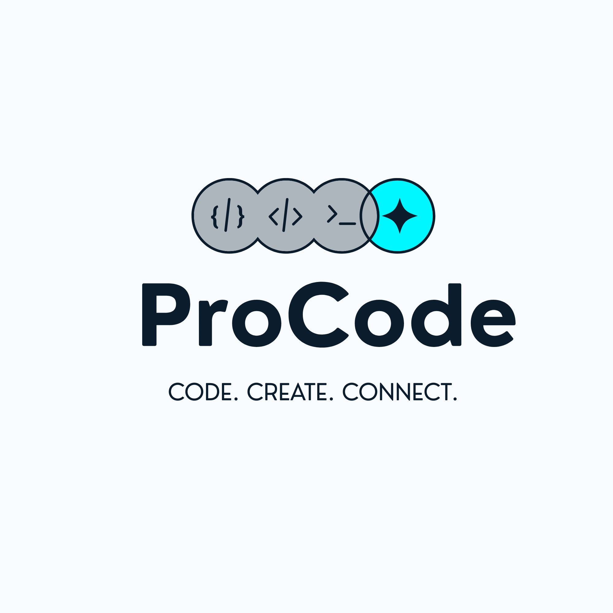

<p align="center">
  
</p>

<h1 align="center">ProCode EduPulse</h1>

<p align="center">
  <strong>A Professional Learning Management System for Coding Education</strong>
</p>

<p align="center">
  
  
  
  
</p>

<p align="center">
  
  
  
</p>

---

## 🎯 Overview

ProCode EduPulse transforms passive YouTube viewers into active students by providing a structured, interactive learning environment. Built entirely with **Vanilla JavaScript** — no frameworks, no build tools, just pure web fundamentals.

### Why ProCode?

| YouTube Alone | ProCode EduPulse |
|---|---|
| Linear video playback | Structured courses with progress tracking |
| No interactivity | In-browser code editor with live preview |
| No assessment | Quizzes + automated coding challenges |
| No personalization | AI-powered hints & timestamped notes |
| No portfolio | Auto-compiled project portfolio |

---

##  Features

### Core Features
-  **YouTube Integration** — Videos embedded alongside lesson notes, cheat sheets, and resources
-  **Interactive Code Playground** — CodeMirror 6 editor with syntax highlighting and live preview
-  **Progress Tracking** — Persistent progress bars, completion status, and quiz scores
-  **Quizzes** — Multiple-choice assessments with explanations and scoring
-  **Coding Challenges** — Automated DOM-based validation for hands-on practice

### Elite Features
-  **AI-Powered Hints** — Context-aware clues via Gemini API (configurable)
-  **Project Portfolio** — Auto-compiled from completed challenges, downloadable as ZIP
- **Timestamped Notes** — Personal notes linked to video timestamps, click to seek
-  **Dark/Light Mode** — Dev-friendly UI optimized for long coding sessions

---

##  Tech Stack

| Layer | Technology |
|-------|-----------|
| **Structure** | HTML5, Semantic Elements |
| **Styling** | CSS3, Custom Properties, Glassmorphism |
| **Logic** | Vanilla JavaScript (ES Modules) |
| **Code Editor** | CodeMirror 6 (via ESM CDN) |
| **Video** | YouTube IFrame API |
| **AI Hints** | Google Gemini API |
| **ZIP Download** | JSZip (via ESM CDN) |
| **Persistence** | localStorage |

---

##  Project Structure

```
procode-edu-pulse-lms/
├── index.html                    # Main entry point (SPA)
├── README.md
├── .gitignore
├── logo.png                      # Brand logo
├── html.png                      # Course thumbnail
│
├── css/
│   ├── variables.css             # Design tokens & themes
│   ├── global.css                # Reset, typography, utilities
│   ├── components.css            # Buttons, cards, modals, badges
│   ├── navbar.css                # Navigation bar
│   ├── landing.css               # Landing page styles
│   └── lesson.css                # Lesson page styles
│
├── js/
│   ├── app.js                    # Router, page renderers, bootstrap
│   ├── components/
│   │   ├── navbar.js             # Navigation component
│   │   ├── sidebar.js            # Course sidebar
│   │   ├── video-player.js       # YouTube embed controller
│   │   ├── code-editor.js        # CodeMirror integration
│   │   ├── quiz.js               # Quiz engine
│   │   ├── challenge.js          # Coding challenge validator
│   │   ├── notes.js              # Timestamped notes
│   │   ├── portfolio.js          # Portfolio builder
│   │   ├── progress-bar.js       # Progress bar
│   │   └── theme-toggle.js       # Dark/light mode
│   ├── services/
│   │   ├── storage.js            # localStorage persistence
│   │   ├── validation.js         # Code validation engine
│   │   └── ai-service.js         # Gemini AI integration
│   └── utils/
│       ├── dom.js                # DOM helpers, toast, animations
│       └── router.js             # Hash-based SPA router
│
└── data/
    ├── courses.json              # Course catalog
    ├── lessons.json              # Lesson content & metadata
    ├── quizzes.json              # Quiz questions
    └── challenges.json           # Coding challenges & validators
```

---

## 🚀 Getting Started

### Prerequisites
- A modern web browser (Chrome, Firefox, Edge, Safari)
- A local dev server (e.g., VS Code Live Server extension)

### Installation

```bash
# Clone the repository
git clone https://github.com/soghayarmahmoud/procode-edu-pulse-lms.git

# Navigate to the project
cd procode-edu-pulse-lms

# Open with Live Server (VS Code)
# Right-click index.html → "Open with Live Server"

# Or use any static server
npx serve .
```

### AI Hints Setup (Optional)
1. Get a [Google Gemini API key](https://aistudio.google.com/apikey)
2. Go to **Profile → Settings → AI Hints**
3. Paste your API key and save

---

## 🗺️ Roadmap

### Phase 1: MVP ✅
- [x] Landing page with course catalog
- [x] Lesson page with video + code editor
- [x] Quiz system with scoring
- [x] Coding challenges with validation
- [x] Progress tracking (localStorage)
- [x] Dark/Light mode

### Phase 2: Enhanced Features ✅
- [x] AI-powered hint system
- [x] Timestamped note-taking
- [x] Project portfolio with ZIP download
- [x] Cheat sheets and resources
- [x] Mobile responsive design

### Phase 3: Future Enhancements
- [x] User authentication (Supabase/Firebase)
- [x] Cloud-based progress sync
- [x] Discussion forums per lesson
- [x] Leaderboard & achievements
- [ ] More courses (React, Node.js, Python)
- [ ] Instructor dashboard
- [x] Certificate generation

---

## 📐 Database Schema (localStorage)

```
┌─────────────────────┐     ┌─────────────────────┐
│   procode_profile    │     │  procode_progress    │
├─────────────────────┤     ├─────────────────────┤
│ name: string         │     │ [courseId]: {         │
│ avatar: string       │     │   completedLessons[] │
│ joinDate: ISO date   │     │   quizScores: {}     │
│ theme: dark|light    │     │   lastAccessed: date │
└─────────────────────┘     │ }                    │
                            └─────────────────────┘

┌─────────────────────┐     ┌─────────────────────┐
│   procode_notes      │     │ procode_submissions  │
├─────────────────────┤     ├─────────────────────┤
│ [lessonId]: [{       │     │ [challengeId]: {     │
│   id, timestamp,     │     │   code: string       │
│   text, createdAt    │     │   passed: boolean    │
│ }]                   │     │   submittedAt: date  │
└─────────────────────┘     │ }                    │
                            └─────────────────────┘
```

---

## 🧪 Code Validation Logic

The validation engine supports multiple rule types:

| Rule Type | Description | Example |
|-----------|-------------|---------|
| `dom-query` | Check if a CSS selector exists in DOM | `"selector": "h1"` |
| `dom-count` | Count elements matching selector | `"selector": "ul > li", "count": 3` |
| `text-contains` | Check if code contains text | `"text": "Hello World"` |
| `regex` | Pattern match with regex | `"pattern": "<h1>.*</h1>"` |
| `css-property` | Verify CSS property value | `"property": "color", "value": "red"` |
| `attribute` | Check element attributes | `"selector": "a", "attribute": "href"` |

---

## 🤝 Contributing

Contributions are welcome! Here's how:

1. **Fork** the repository
2. **Create** a feature branch: `git checkout -b feature/amazing-feature`
3. **Commit** your changes: `git commit -m 'Add amazing feature'`
4. **Push** to the branch: `git push origin feature/amazing-feature`
5. **Open** a Pull Request

### Adding New Courses

1. Add course entry to `data/courses.json`
2. Add lessons to `data/lessons.json`
3. Add quizzes to `data/quizzes.json`
4. Add challenges to `data/challenges.json`

---

## 📄 License

This project is licensed under the MIT License — see the [LICENSE](LICENSE) file for details.

---

<p align="center">
  Built with ❤️ by <a href="https://github.com/soghayarmahmoud">soghayarmahmoud</a>
</p>
